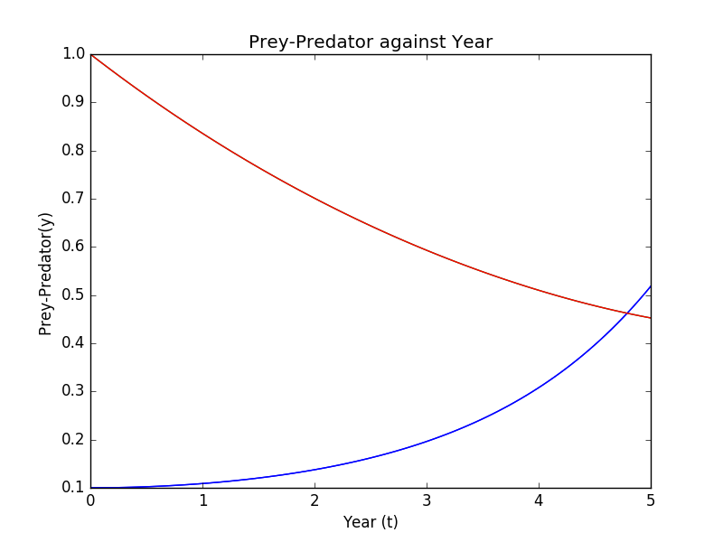
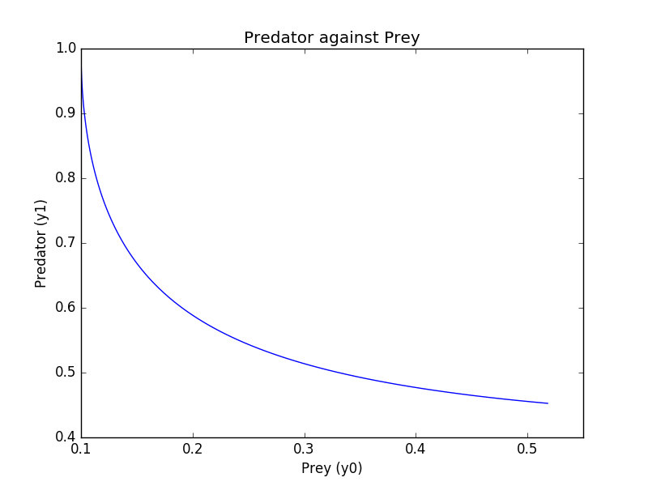
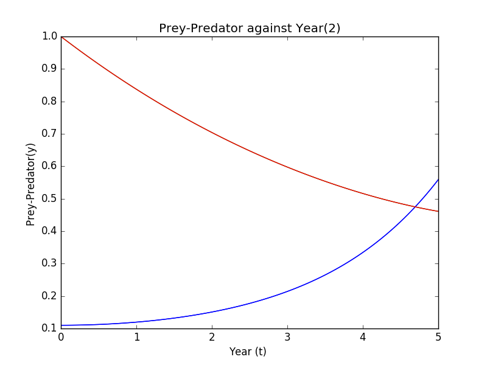
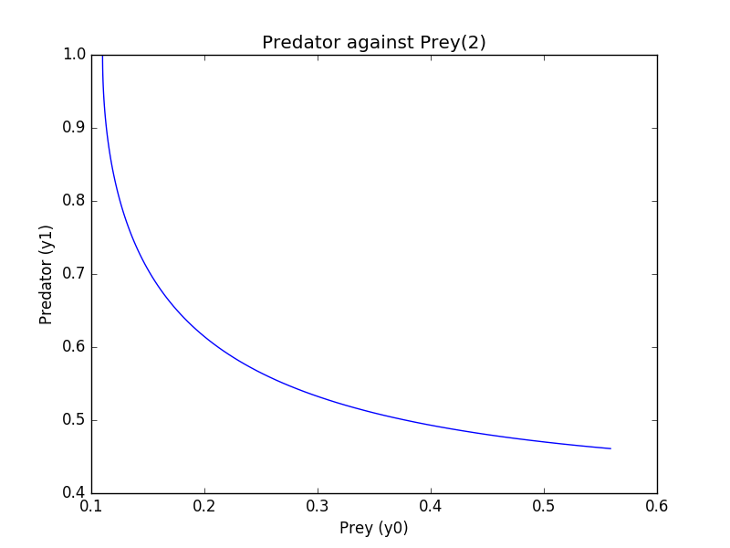

UECM3033 Assignment #3 Report
========================================================

- Prepared by: E Hung Yang
- Tutorial Group: T3

--------------------------------------------------------

## Task 1 --  Gauss-Legendre formula

The reports, codes and supporting documents are to be uploaded to Github at: 

https://github.com/EHungYang1/UECM3033_assign3

Explain how you implement your `task1.py` here.
The function of def gausslegendre(f,a,b,n=20) is put in to find the Gauss-Legendre quadrature. And also the polynomial.legendre.leggauss is used to find the sample points and weights for Gauss-Legendre quadrature. I used Lagrange polynomial to tranfrom the interval which is given by y = a((x-1)/(-1-1)) + b((x+1)/(1+1)) and the jacobian for this transformation is (b-a)/2 to find the answer.

Explain how you get the weights and nodes used in the Gauss-Legendre quadrature.
Weights and nodes can be used by putting in np.polynomial.legendre.leggauss.
---------------------------------------------------------

## Task 2 -- Predator-prey model

Explain how you implement your `task2.py` here, especially how to use `odeint`.
Firstly i import the numpy, script,matplotlib.pyplot as plt. Then a self-defined function is created to identify the equation of differentiated prey and predator equations which is given and the parameters a and b also needed to put into the function. Then the initial condition of x is 0, the y will be 0.1 and 1.0 is put in. The interval is divided into 100 interval using t=np.linspace(0, 5, 100). The solution will then integrated by the scipy.integrate.odeint of self-defined function. Then the graphs of y0 and y1 against t is plotted and labelled with lines of blue and red. Then the second part is repeated with y0=0.01 and y1=1.0.

Put your graphs here and explain.

The population or number of prey (y0) is the lowest and the predators (y1) is the highest at the beginning. But then the predators was declined as there is lack of food(prey), so the prey able to increase their population. As the time increase, the number of prey will increases over time while the number of predators is decreasing. When the predator population decrease, the prey population will increase. This will continue in a cycle of growth and decline.

Is the system of ODE sensitive to initial condition? Explain.
The difference between the graph for both graph is not very obvious,so the system of ODE is not sensitive to initial condition.
-----------------------------------

last modified: 17/4/2016
